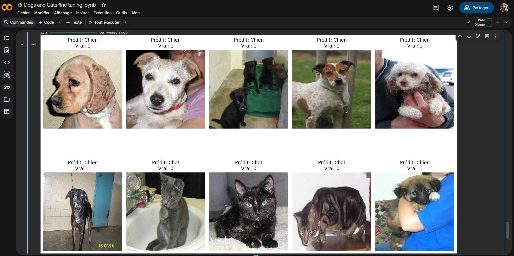

# 🐶🐱 Dogs vs Cats — Fine-tuning VGG16

Classification binaire chiens/chats par transfer learning sur VGG16, entraîné sur Google Colab.

---

## 📌 Description

Ce projet implémente un classificateur d'images capable de distinguer les chiens des chats en utilisant le **fine-tuning** du modèle pré-entraîné **VGG16** (ImageNet). Seul le bloc `block5` de VGG16 est dégelé et ré-entraîné, le reste du réseau restant figé.

---

## 🏗️ Architecture du modèle

```
VGG16 (pré-entraîné ImageNet)
  └── block1–block4 : gelés (non entraînables)
  └── block5 : fine-tuné
Flatten
Dense(512, relu)
Dropout(0.5)
Dense(1, sigmoid)   ← sortie binaire (chien=1 / chat=0)
```

**Compilateur :** RMSprop (lr=2e-5)  
**Loss :** Binary Crossentropy  
**Métrique :** Accuracy

---

## 📂 Structure du projet

```
Dogs_and_Cats_fine_tuning.ipynb   # Notebook principal
cats_and_dogs_small_vgg16.h5      # Modèle sauvegardé (Google Drive)
```

---

## 📦 Prérequis

- Python 3.x
- TensorFlow / Keras
- Pandas, NumPy, Matplotlib
- Google Colab (recommandé — accès GPU + Google Drive)

```bash
pip install tensorflow pandas numpy matplotlib
```

---

## 🚀 Utilisation

1. **Monter Google Drive** et placer le dataset dans :
   ```
   My Drive/Datasets/Dogs vs Cats/
   ├── train/        # images d'entraînement (dog.*.jpg / cat.*.jpg)
   └── test_set/     # images de test
   ```

2. **Ouvrir le notebook** `Dogs_and_Cats_fine_tuning.ipynb` dans Google Colab.

3. **Exécuter toutes les cellules** (`Exécution > Tout exécuter`).

4. Le modèle entraîné est automatiquement sauvegardé dans :
   ```
   My Drive/cats_and_dogs_small_vgg16.h5
   ```

---

## 🔧 Data Augmentation

Appliquée sur les données d'entraînement pour améliorer la généralisation :

| Paramètre         | Valeur |
|-------------------|--------|
| Rotation          | ±60°   |
| Décalage largeur  | 20%    |
| Décalage hauteur  | 20%    |
| Cisaillement      | 20%    |
| Zoom              | 20%    |
| Retournement H    | Oui    |
| Remplissage       | nearest|

---

## 📊 Entraînement

| Paramètre        | Valeur |
|------------------|--------|
| Taille d'image   | 150×150 px |
| Batch size       | 32     |
| Steps per epoch  | 50     |
| Epochs           | 30     |

---

## 📈 Résultats

Le modèle affiche les courbes d'exactitude et de perte (entraînement vs validation) après l'entraînement, et réalise des prédictions visuelles sur 10 images de test.

> Exemple de prédictions (voir screenshot) :


---

## 📄 Licence

Ce projet est à usage éducatif. Le dataset Dogs vs Cats est issu de [Kaggle](https://www.kaggle.com/c/dogs-vs-cats).
